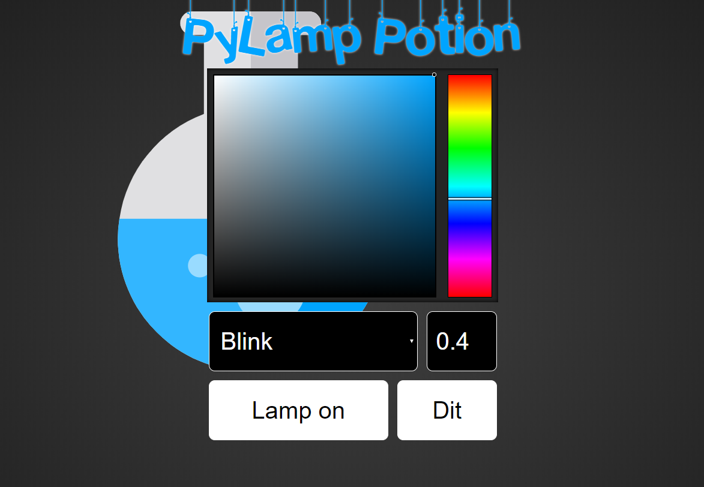

# PyLamp Potion

Small hobby project with the aim to control a
 [LED Potion Desk Lamp](https://www.thinkgeek.com/product/imro) 
 from [ThinkGeek, Inc.](https://www.thinkgeek.com)
 with:
 - Infrared Remote Control
 - Web interface / REST
 - Homekit
 
You will not find a How-To or other install instructions here. Just sample code and sample config files.
Take over what you need, have fun.

## Hardware Ingredients

- Potion Lamp (https://www.thinkgeek.com/product/imro/)
- LED - RGB Clear (https://www.sparkfun.com/products/105)
- IR Receiver Diode - TSOP38238 (https://www.sparkfun.com/products/10266)
- Infrared Remote Control (https://www.sparkfun.com/products/14865)

## Software Ingredients
- Python 2.7 (might work on lower / higher versions as well)
- lircd (see sparkfun.lircd.conf)
- pigpiod
- Python libraries
  - twisted & autobahn (webserver)
  - lirc (Remote control reader)
  - pigpio (faster/hw pwm)
- Web interface
  - jQuery
  - spectrum
- Homekit / HAP-NodeJS plugins
  - homebridge-http-rgb-bulb (see homekit.config.json)